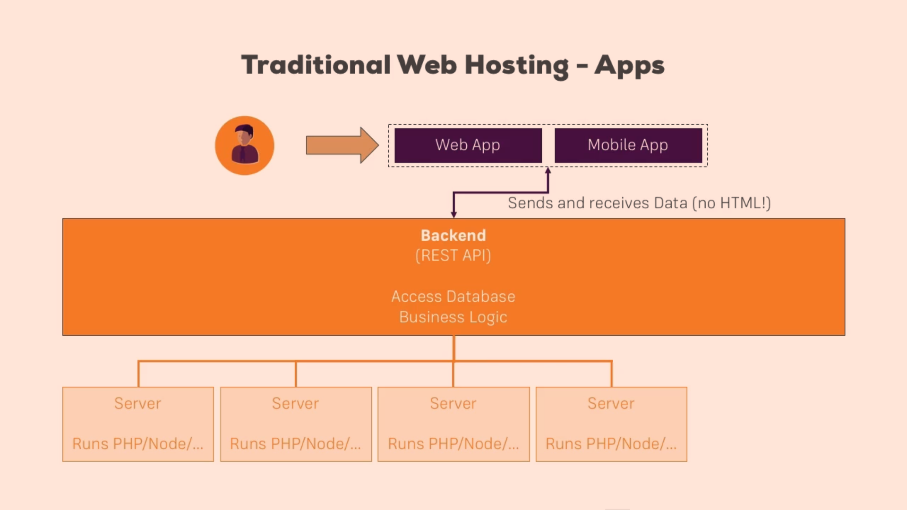
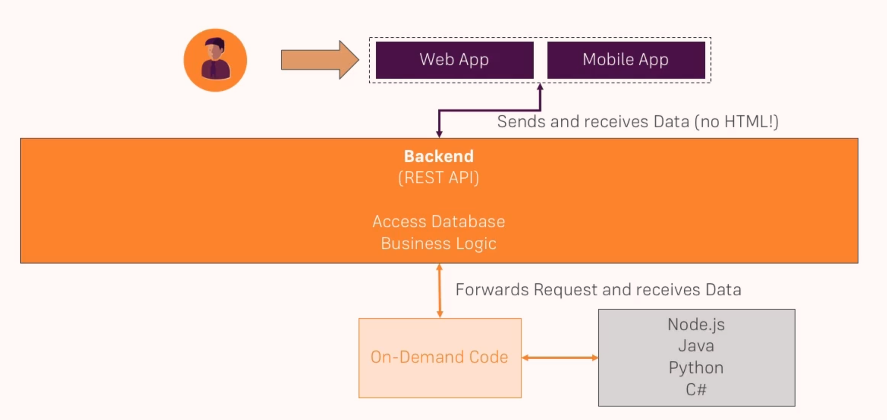
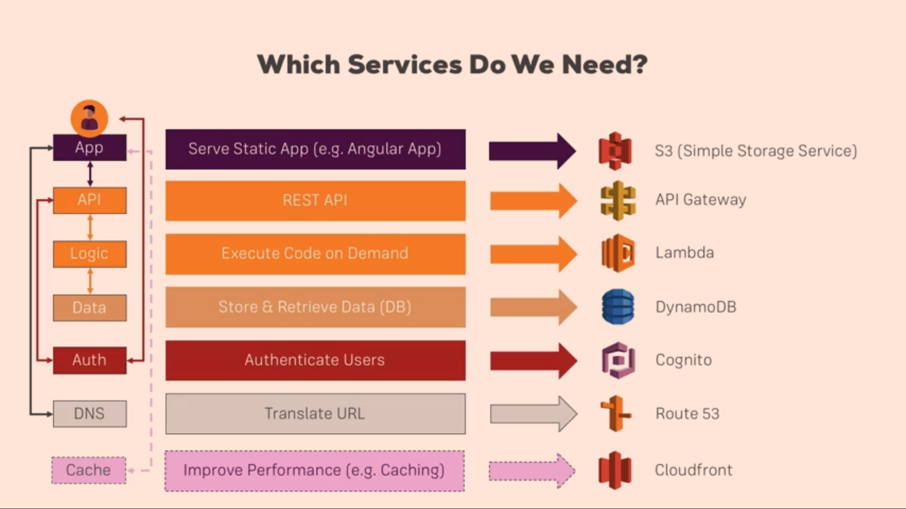
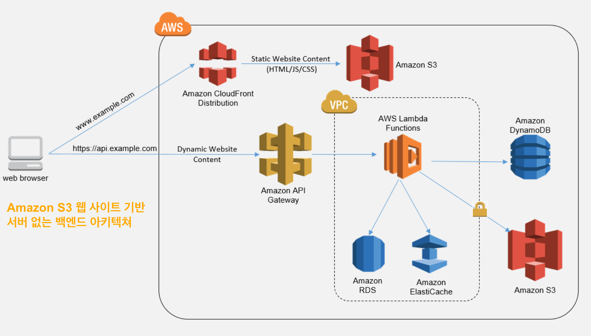
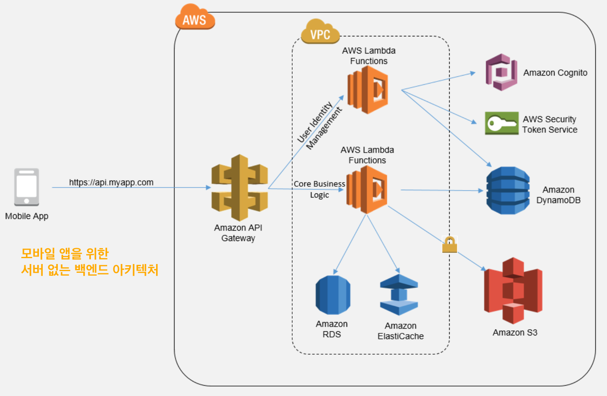
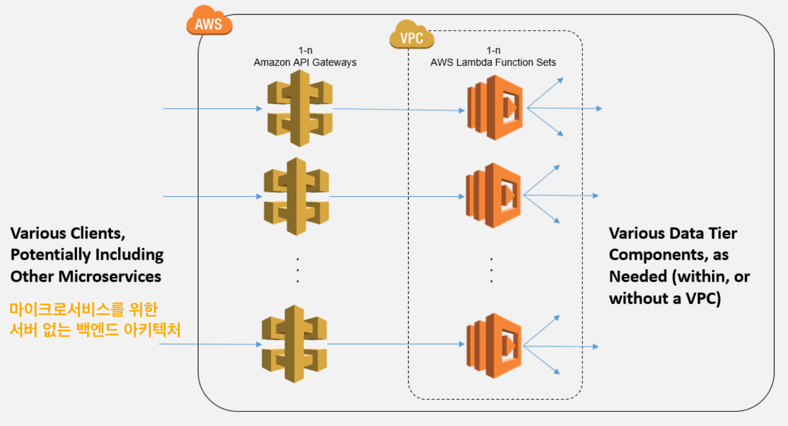
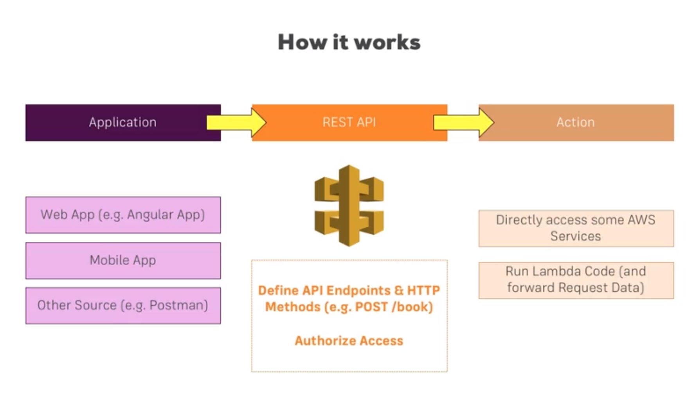
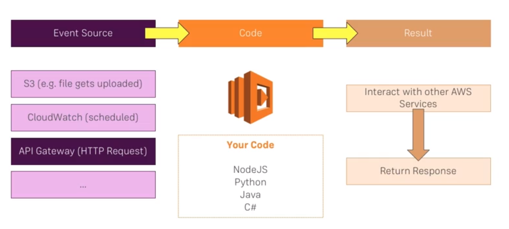

# AWS Serverless Study

## Table of Contents
- [순서](#순서)
- [Serverless 란?](#Serverless-란?)
- [Why AWS?](#Why-AWS?)
- [핵심 Serverless 서비스](#핵심-Serverless-서비스)
- [API Gateway 란?](#API-Gateway-란?)
- [AWS Lambda 란?](#AWS-Lambda-란?)

---

## 순서
1. [Serverless 란?](#Serverless-란?)
2. [핵심 Serverless 서비스](#핵심-Serverless-서비스)
3. [**API Gateway** 와 **Lambda** 를 사용하여 REST API 만들기](#API-Gateway-와-Lambda-를-사용하여-REST-API-만들기)
4. **DynamoDB** 데이터 저장
5. **Cognito** 사용자 인증
6. **S3**, **CloudFront** 와 **Route53** 을 사용한 콘테츠 딜리버리 및 호스팅

---

## Serverless 란?

> - **운영상의 (~~책임~~) 관리**를 클라우드 컴퓨팅 제공업체에게 전환하여 민첩성과 혁신을 높일 수 있도록 하는 **클라우드의 네이티브 아키텍처**
> - **서버를 고려하지 않고** 애플리케이션과 서비스를 구축하고 실행
> - 서버 패치 적용, 운영 체제 유지 관리 및 용량 프로비저닝과 같은 **인프라 관리**
> - 애플리케이션을 고가용성으로 실행하고 확장하는 데 필요한 모든 사항이 **자동으로 처리**

### ■ 전통적인 Web Hosting

> - **전산실**이 시스템에 필요한 모든 인프라(공간, 하드웨어, 네트워크, 운연체제)를 모두 직접 관리
> - 시스템이 커질수록 유지 할 관리자 필요, 인력에 대한 비용 늘어남

> ※ **단점**
> - 서버가 사용 되지 않을때도 항상 살아있고 대기중이어야 한다.
> - 적정 성능/크기의 서버를 예측하기 힘들다. (너무 과하거나 모자르거나..)
> - OS와 소프트웨어의 주기적인 update가 필요하다.

### ■ IaaS (Infrastructure as a Service)

> - AWS EC2, Azure 등
> - 서버자원, 네트워크, 전력 등의 인프라를 관리해줌
> - 사용자는 서버, 네트워크, 하드웨어, OS등을 설정만 하면 됨
> - 쉽게 모니터링 가능

### ■ PaaS (Platform as a Service)

> - IaaS에서 한번 더 추상화되어 런타임까지 제공
> - AWS Elastic Beanstalk, Azure App Services 등
> - 사용자는 애플리케이션만 배포, 바로 구동 할 수 있음
> - 쉬운 Auto Scaling, Load Balancing

### ■ Serverless 어플리케이션 (BaaS, FaaS)

> - Baas - Backend as a Service
> - FaaS - Function as a Service
> - 서버의 존재 자체를 신경쓰지 않아도 됨
> - 서버가 어떤 사양으로 돌아가는지, 서버의 갯수를 늘려야 할지, 네트워크는 어떤걸 사용할지 등의 설정 자체가 필요 없음

> ※ **장점**
> - 필요할때만 On-Demand로 실행
> - 무제한 용량
> - 실행된 코드만 비용 지불
> - 필요한 것만 비용 지불
> - 사용량에 따라 자동으로 확장
> - AWS Managed 인프라에서 실행
> - 코드가 최신의 안전한 환경에서 실행

> ※ **단점**
> - 함수에서 사용 할 수 있는 자원에 제한이 있음 (Max 1.5Gb 메모리, 처리 시간 300초)
> - Local 데이터 사용불가 (AWS S3, Azure Storage 등 사용)

> **Use Case**
> - 서비스의 백엔드
> - 주기적인 크롤링
> - 파일 업로드시 화질/사이즈 등 파일 처리
> - 로그 분석 / 실시간 모니터링 등 

## Why AWS?

Microsoft Azure Functions, Google Cloud Platform Functions...

- Market 리더
- 가장 많은 Serverless 서비스
- 착한 가격 정책
- 신속한 혁신과 새로운 기능

---

## 핵심 Serverless 서비스

### 백엔드
- API Gateway
- Lambda
- DynamoDB
- Cognito

### Example - Amazon S3 웹 사이트를 위한 서버 없는 백엔드 아키텍처

### Example - 모바일 앱을 위한 서버 없는 아키텍처

### Example - 마이크로서비스를 위한 서버 없는 백엔드 아키텍처

### For more information...
- S3 - https://aws.amazon.com/s3/?nc2=h_m1
- API Gateway - https://aws.amazon.com/api-gateway/?nc2=h_m1
- Lambda - https://aws.amazon.com/lambda/?nc2=h_m1
- DynamoDB - https://aws.amazon.com/dynamodb/?nc2=h_m1
- Cognito - https://aws.amazon.com/cognito/?nc2=h_m1
- Route 53 - https://aws.amazon.com/route53/?nc2=h_m1
- CloudFront - https://aws.amazon.com/cloudfront/?nc2=h_m1

---

## API Gateway 와 Lambda 를 사용하여 REST API 만들기

## API Gateway 란?

- API Gateway **Overview** - https://aws.amazon.com/api-gateway
- API Gateway **Developer Documentation** - https://aws.amazon.com/documentation/apiga

## AWS Lambda 란?

On-demand Computing

- AWS Lambda **Overview** - https://aws.amazon.com/lambda/
- AWS Lambda **Developer Documentation** - http://docs.aws.amazon.com/lambda/latest/dg/welcome.html