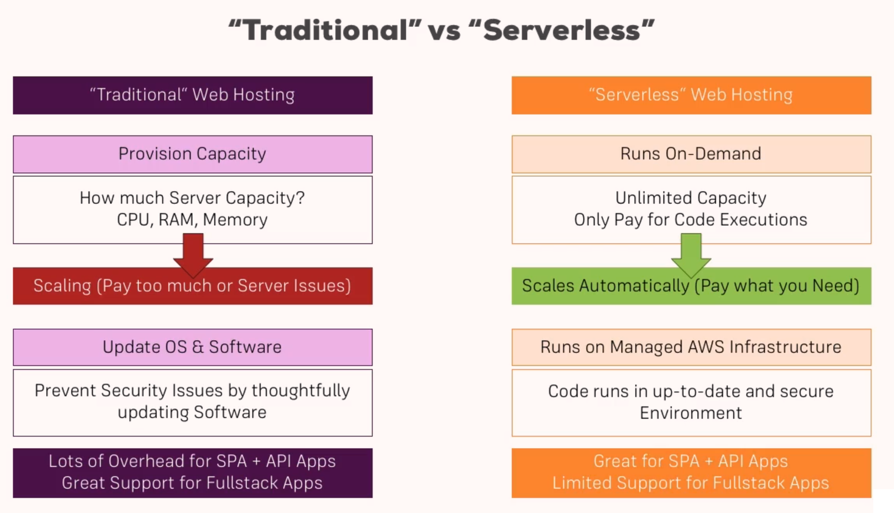

# AWS Serverless Study

## Table of Contents
* What is Serverless Development?

### What is Serverless Development?

Traditional Web Hosting

문제점

- Re-invent the Wheel
- Servers are online even if not required
- Over or underprovision
- Keep OS & software updared

Serverless Apps

Traditional VS. Serverless
