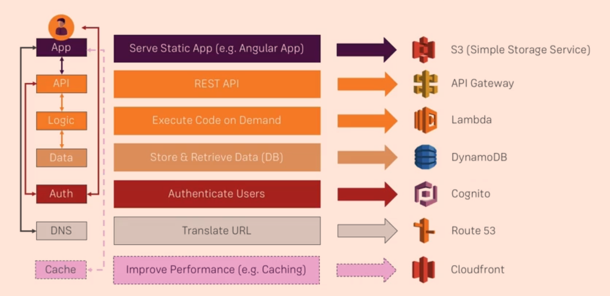

# AWS Serverless Study

## Table of Contents
- [Course Structure](#Course-Structure)
- [Serverless 란?](#Serverless-란?)
- [Why AWS?](#Why-AWS?)
- [Core Serverless Services](#Core-Serverless-Services)
- [What is API Gateway?](#What-is-API-Gateway?)
- [What is AWS Lambda?](#What-is-AWS-Lambda?)

---

## Course Structure
1. [What is Serverless Development](#What-is-Serverless-Development?)
2. [Core Serverless Services](#Core-Serverless-Services)
3. [Business Logic with **Lambda** and **API Gateway**](#Creating-an-API-with-API-Gateway-&-AWS-Lambda)
4. Data Storage with **DynamoDB**
5. Authentication with **Cognito**
6. Content Delivery & Hosting with **S3**, **CloudFront** and **Route53**

---

## Serverless 란?

### ■ 전통적인 Web Hosting

> ※ **단점**
> - Re-invent the Wheel
> - 서버가 사용 되지 않을때도 항상 대기중이어야 한다.
> - 적정 성능/크기의 서버를 예측하기 힘들다. (너무 과하거나 모자르거나..)
> - OS와 소프트웨어의 주기적인 update가 필요하다.

### ■ Serverless 어플리케이션

> ※ **장점**
> - Runs On-Demand
> - Unlimited Capacity
> - Only Pay for Code Executions
> - Scales Automatically (Pay what you need)
> - Runs on Managed AWS Infrastructure
> - Code runs in up-to-date and secure Environment

## Why AWS?

Microsoft Azure, Google Cloud Platform...

- Market Leader
- Most Serverless Services
- Aggressive Pricing
- Rapid Innovation & New Features

---

## Core Serverless Services

### For Back-end...
- API Gateway
- Lambda
- DynamoDB
- Cognito

### For more information...
- S3 - https://aws.amazon.com/s3/?nc2=h_m1
- API Gateway - https://aws.amazon.com/api-gateway/?nc2=h_m1
- Lambda - https://aws.amazon.com/lambda/?nc2=h_m1
- DynamoDB - https://aws.amazon.com/dynamodb/?nc2=h_m1
- Cognito - https://aws.amazon.com/cognito/?nc2=h_m1
- Route 53 - https://aws.amazon.com/route53/?nc2=h_m1
- CloudFront - https://aws.amazon.com/cloudfront/?nc2=h_m1

---

## Creating an API with API Gateway & AWS Lambda

## What is API Gateway?

- API Gateway **Overview** - https://aws.amazon.com/api-gateway
- API Gateway **Developer Documentation** - https://aws.amazon.com/documentation/apiga

## What is AWS Lambda?

On-demand Computing

- AWS Lambda **Overview** - https://aws.amazon.com/lambda/
- AWS Lambda **Developer Documentation** - http://docs.aws.amazon.com/lambda/latest/dg/welcome.html