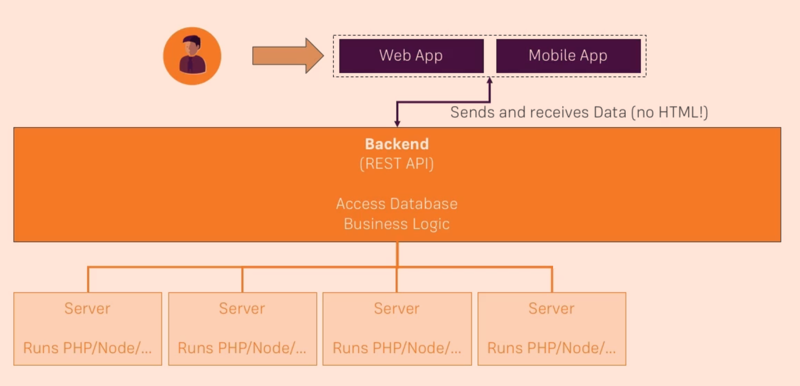

# AWS Serverless Study

## Table of Contents
- [Course Structure](#Course-Structure)
- [What is Serverless Development?](#What-is-Serverless-Development?)
- [Why AWS?](#Why-AWS?)
- [Core Serverless Services](#Core-Serverless-Services)
- [What is API Gateway?](#What-is-API-Gateway?)

---

## Course Structure
1. [What is Serverless Development](#What-is-Serverless-Development?)
2. [Core Serverless Services](#Core-Serverless-Services)
3. [Business Logic with **Lambda** and **API Gateway**](#Creating-an-API-with-API-Gateway-&-AWS-Lambda)
4. Data Storage with **DynamoDB**
5. Authentication with **Cognito**
6. Content Delivery & Hosting with **S3**, **CloudFront** and **Route53**

---

## What is Serverless Development?

### Traditional Web Hosting

### 문제점

- Re-invent the Wheel
- Servers are online even if not required
- Over or underprovision
- Keep OS & software updared

### Serverless Apps

### Traditional VS. Serverless

## Why AWS?

- Market Leader
- Most Serverless Services
- Aggressive Pricing
- Rapid Innovation & New Features

---

## Core Serverless Services

### Which Services Do We Need?

### For Back-end...
- API Gateway
- Lambda
- DynamoDB
- Cognito

### For more information...
- S3 - https://aws.amazon.com/s3/?nc2=h_m1
- API Gateway - https://aws.amazon.com/api-gateway/?nc2=h_m1
- Lambda - https://aws.amazon.com/lambda/?nc2=h_m1
- DynamoDB - https://aws.amazon.com/dynamodb/?nc2=h_m1
- Cognito - https://aws.amazon.com/cognito/?nc2=h_m1
- Route 53 - https://aws.amazon.com/route53/?nc2=h_m1
- CloudFront - https://aws.amazon.com/cloudfront/?nc2=h_m1

---

## Creating an API with API Gateway & AWS Lambda

## What is API Gateway?