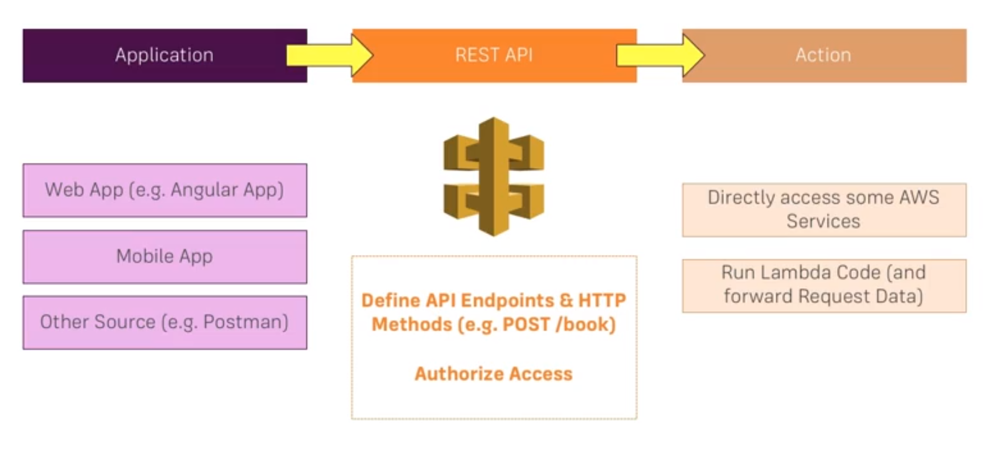

# AWS Serverless Study

## Table of Contents
- [Course 순서](#Course-순서)
- [Serverless 란?](#Serverless-란?)
- [Why AWS?](#Why-AWS?)
- [핵심 Serverless 서비스](#핵심-Serverless-서비스)
- [API Gateway 란?](#API-Gateway-란?)
- [AWS Lambda 란?](#AWS-Lambda-란?)

---

## Course 순서
1. [Serverless 개발이란?](#Serverless-란?)
2. [핵심 Serverless 서비스](#핵심-Serverless-서비스)
3. [**Lambda** 와 **API Gateway** 을 사용하여 REST API 만들기](#Lambda-와-API-Gateway-을-사용하여-REST-API-만들기)
4. **DynamoDB** 데이터 저장
5. **Cognito** 사용자 인증
6. **S3**, **CloudFront** 와 **Route53** 을 사용한 콘테츠 딜리버리 및 호스팅

---

## Serverless 란?

### ■ 전통적인 Web Hosting

> ※ **단점**
> - Re-invent the Wheel
> - 서버가 사용 되지 않을때도 항상 대기중이어야 한다.
> - 적정 성능/크기의 서버를 예측하기 힘들다. (너무 과하거나 모자르거나..)
> - OS와 소프트웨어의 주기적인 update가 필요하다.

### ■ Serverless 어플리케이션

> ※ **장점**
> - Runs On-Demand
> - Unlimited Capacity
> - Only Pay for Code Executions
> - Scales Automatically (Pay what you need)
> - Runs on Managed AWS Infrastructure
> - Code runs in up-to-date and secure Environment

## Why AWS?

Microsoft Azure, Google Cloud Platform...

- Market Leader
- Most Serverless Services
- Aggressive Pricing
- Rapid Innovation & New Features

---

## 핵심 Serverless 서비스

### For Back-end...
- API Gateway
- Lambda
- DynamoDB
- Cognito

### For more information...
- S3 - https://aws.amazon.com/s3/?nc2=h_m1
- API Gateway - https://aws.amazon.com/api-gateway/?nc2=h_m1
- Lambda - https://aws.amazon.com/lambda/?nc2=h_m1
- DynamoDB - https://aws.amazon.com/dynamodb/?nc2=h_m1
- Cognito - https://aws.amazon.com/cognito/?nc2=h_m1
- Route 53 - https://aws.amazon.com/route53/?nc2=h_m1
- CloudFront - https://aws.amazon.com/cloudfront/?nc2=h_m1

---

## Lambda 와 API Gateway 을 사용하여 REST API 만들기

## API Gateway 란?

- API Gateway **Overview** - https://aws.amazon.com/api-gateway
- API Gateway **Developer Documentation** - https://aws.amazon.com/documentation/apiga

## AWS Lambda 란?

On-demand Computing

- AWS Lambda **Overview** - https://aws.amazon.com/lambda/
- AWS Lambda **Developer Documentation** - http://docs.aws.amazon.com/lambda/latest/dg/welcome.html